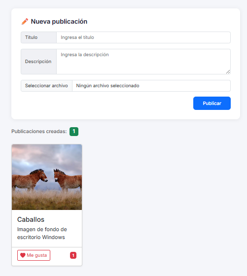

# ❤️ Like Simulator – Frontend Web Application

Interactive frontend web application that allows users to create posts with images, titles, and descriptions while simulating social media interaction through a dynamic **like system**.

---

## 📸 Project Preview

Below is a preview of the application interface.

---

## 🎯 Project Overview

This project demonstrates:

- Dynamic DOM manipulation  
- Event-driven programming  
- Client-side state management  
- Interactive UI feedback  

The application allows users to:

- Create new posts dynamically  
- Upload images from their local device  
- Display posts as responsive cards  
- Interact with posts using a **like button**  
- Track the total number of posts created  

---

## 💡 Why I Built This Project

I built this application to strengthen my understanding of **frontend development and DOM manipulation using JavaScript**.

My main goals were:

- To practice creating **dynamic UI components**
- To understand how to manage **events in dynamically generated elements**
- To implement **client-side interaction logic**
- To build a realistic **social-media-like interaction model**
- To reinforce clean separation between **HTML structure, CSS styling, and JavaScript logic**

This project reflects my interest in building interactive web interfaces that simulate real-world user experiences.

---

## 🚧 Challenges & Learnings

During the development of this project, I encountered several practical challenges that strengthened my frontend development skills.

### 🔹 Dynamic DOM Generation

Generating new cards dynamically required constructing HTML elements programmatically and inserting them into the DOM.  
This reinforced my understanding of DOM APIs and element lifecycle.

### 🔹 Event Handling for Dynamic Elements

Managing interactions for buttons created dynamically required careful handling of event listeners.  
This improved my understanding of how JavaScript handles event binding and delegation.

### 🔹 Managing Local Image Files

Allowing users to upload images without sending them to a server required using:

This helped me understand how browsers handle temporary object URLs and file references.

### 🔹 Memory Management

Because object URLs persist in memory, I implemented:

to properly release resources when the page unloads.

### 🔹 UI Feedback and Animations

Implementing visual feedback when pressing the **like button** required dynamic class changes and CSS transitions.  
This strengthened my ability to design engaging user interactions.

---

## 🏗 Architecture

### 🔹 Frontend

- Semantic HTML5  
- CSS3 styling  
- Bootstrap responsive layout  
- Vanilla JavaScript (ES6)  
- Dynamic DOM manipulation  
- File input handling  
- Event listeners and UI state updates  

---

## 🔄 Application Flow

1️⃣ User enters a title and description.  

2️⃣ User uploads an image from their device.  

3️⃣ The application validates the input fields.  

4️⃣ A new **post card** is dynamically generated.  

5️⃣ The post is added to the card container.  

6️⃣ The post counter updates automatically.  

7️⃣ Users can press the **Like button** to increment the like counter.

---

## 🧠 Technical Skills Demonstrated

- ⚙️ Frontend application architecture  
- 🖱️ DOM manipulation with JavaScript  
- 🔗 Event-driven programming  
- 🧩 Dynamic UI component creation  
- 📁 Browser file handling  
- 🎨 Responsive UI design with Bootstrap  
- ⚡ Interactive UI animations  
- 🗂️ Clean separation of HTML, CSS, and JavaScript  

---

## 🔮 Future Improvements

- 💾 Persist posts using **LocalStorage**
- 💬 Add a **comment system**
- 🗑️ Allow deleting posts
- ❤️ Toggle like/unlike state
- 🎞️ Improve UI animations
- 🌐 Convert into a **full stack social feed**
- ☁️ Deploy backend with database storage

---

## 👩‍💻 Author

**Victoria Eugenia Patarroyo Villamil**  
Aspiring Full Stack Developer focused on building scalable and practical web applications.

GitHub  
https://github.com/victoriapatarroyo  

LinkedIn  
https://www.linkedin.com/in/victoriaeugeniapatarroyo/

---

## 📄 License

This project is licensed under the **MIT License**.
